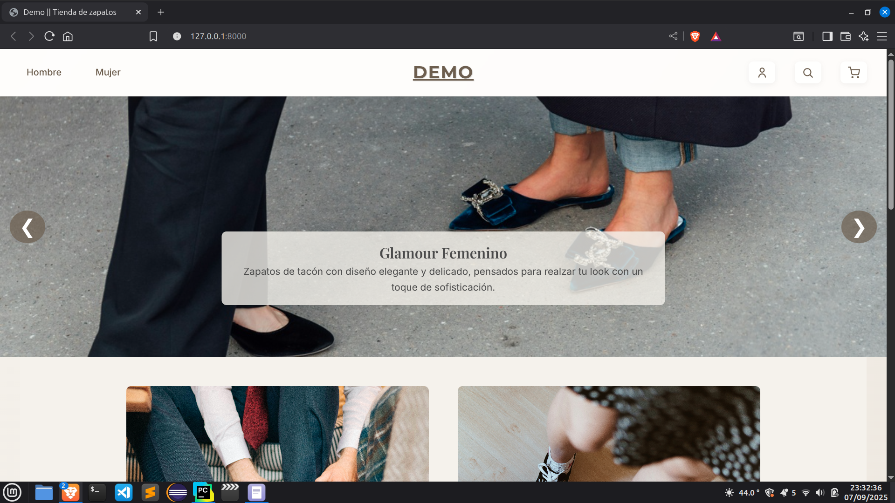
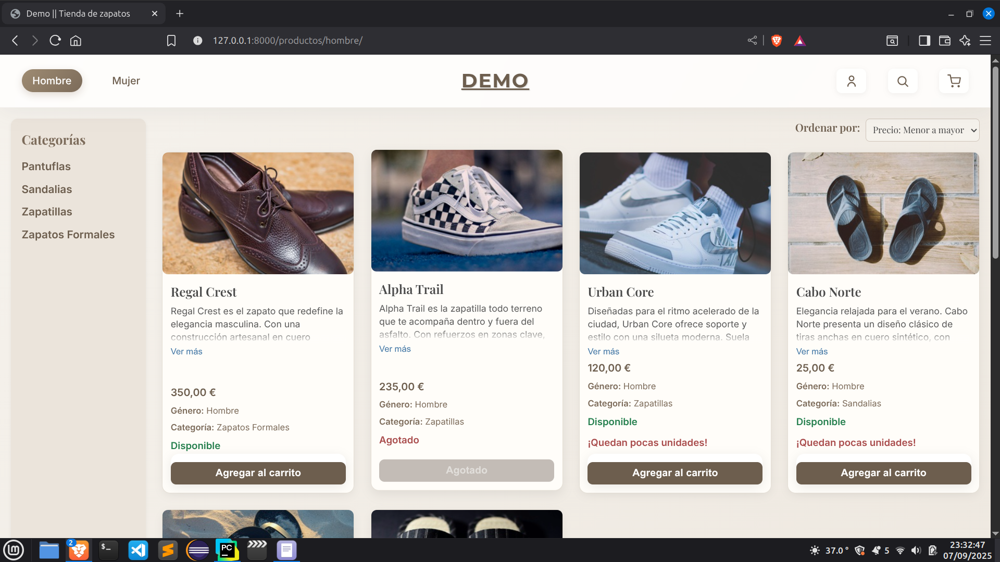
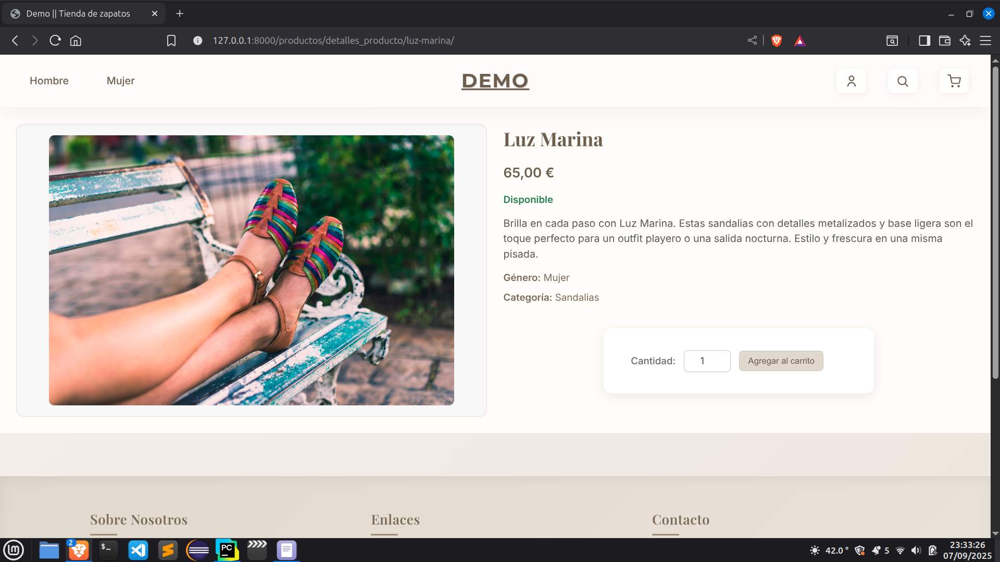
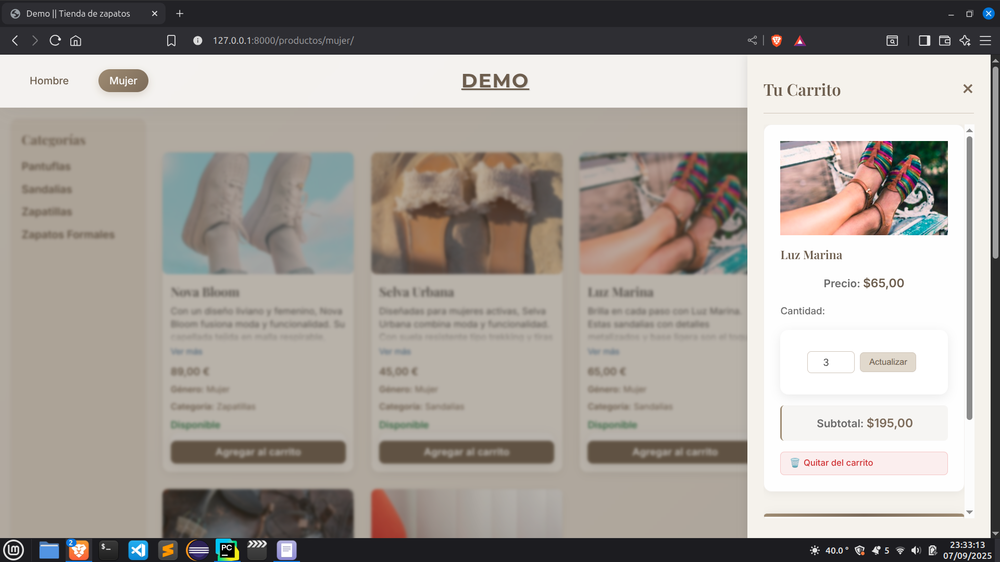
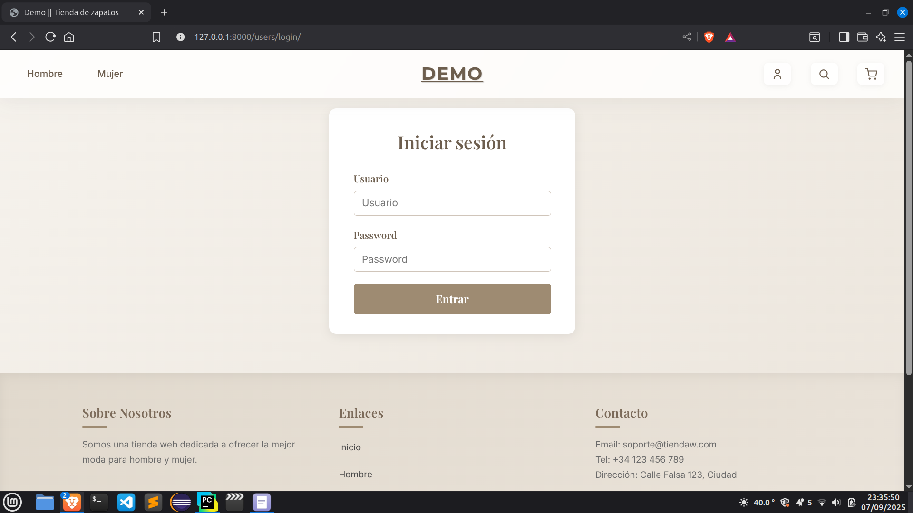
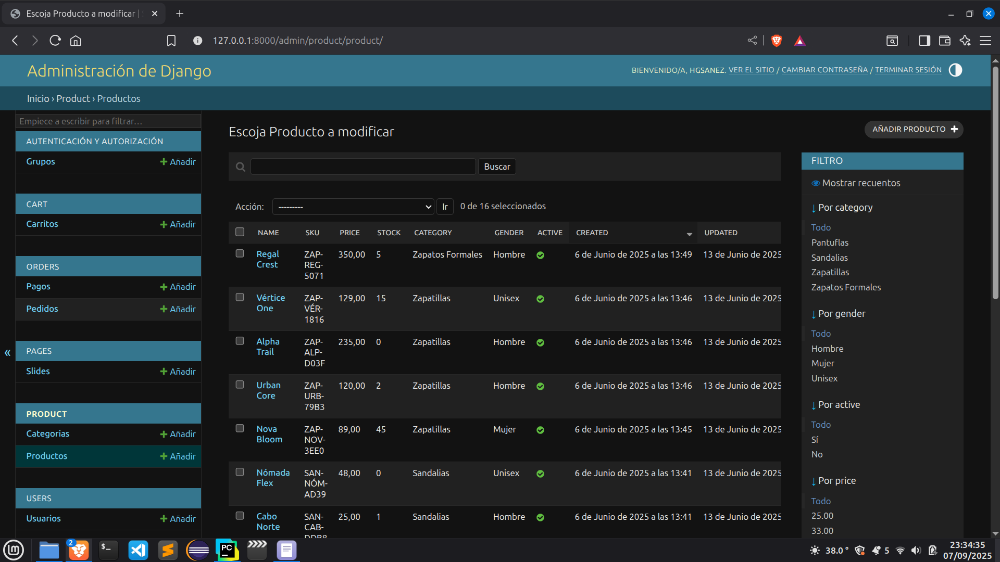

# 🛒 Django eCommerce Web App

**Django eCommerce Web App – Online Store Demo**  
A complete online store built with Django, featuring user registration, product browsing, shopping cart functionality, and a fully functional admin panel.  
⚠️ Note: The project is currently under active development. Future improvements include online payment integration and responsive design.

---

## 📸 Screenshots
🏠 Home Page  
  

🛍 Product Listing  
  

📦 Product Detail / Add to Cart  
  

🛒 Shopping Cart  
  

👤 User Registration / Login  
  

⚙️ Admin Panel (basic configuration)  


---

## ✨ Features
- ✅ User registration and authentication  
- 🛒 Add products to cart while logged out and merge on login  
- 📦 Products and categories management  
- 📄 Pagination for product lists  
- 📑 List products by category and gender 
- 🏷️ Display products as available or out of stock  
- 💰 Shopping cart updates: quantity, subtotal, and stock adjustment after purchase  
- 💻 Admin panel (default Django admin, basic configuration)  
- ⚠️ Notes:
  - Payment is currently done via manual proof (online payment gateway integration planned)  
  - The app is desktop-focused and does not yet include fully responsive design  
  - Additional sections and improvements are planned for future versions  

---

## ⚙️ Installation (Local)

```bash
# Clone the repository and navigate into it
git clone https://github.com/Ditract/Ecommerce-django.git
cd Ecommerce-django

# Create and activate a virtual environment
python3 -m venv venv
source venv/bin/activate

# Install dependencies
pip install -r requirements.txt

# Apply migrations
python manage.py migrate

# Create a media folder in the project root for product images
mkdir media
# Django will automatically create subfolders like 'products/YYYY/MM/DD/' when images are uploaded
# This folder must be in the project root and is ignored in GitHub to keep the repository lightweight

# Run the development server
python manage.py runserver

# Open your browser at http://127.0.0.1:8000/ to see the store in action
